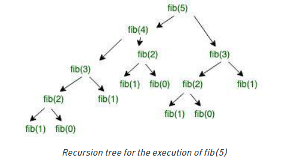
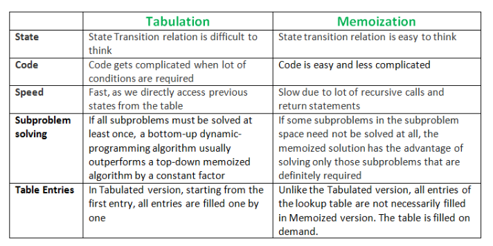

# Dynamic Programming Using C++
Dynamic Programming is an algorithmic paradigm that solves a given complex problem by breaking it into subproblems using recursion and storing the results of subproblems to avoid computing the same results again. Following are the two main properties of a problem that suggests that the given problem can be solved using Dynamic programming.
* Overlapping Subproblems 
* Optimal Substructure

## Overlapping SubProblems
Like Divide and Conquer, Dynamic Programming combines solutions to sub-problems. Dynamic Programming is mainly used when solutions to the same subproblems are needed again and again. In dynamic programming, computed solutions to subproblems are stored in a table so that these don’t have to be recomputed. So Dynamic Programming is not useful when there are no common (overlapping) subproblems because there is no point in storing the solutions if they are not needed again. For example, `Binary Search` doesn’t have common subproblems. If we take the example of following a recursive program for Fibonacci Numbers, there are many subproblems that are solved again and again.

```cpp
#include <iostream>
using namespace std;
 
/* a simple recursive program for Fibonacci numbers */
int fib(int n)
{
    if (n <= 1)
        return n;
    return fib(n - 1) + fib(n - 2);
}
 
int main() {
    cout << fib(7);
    return 0;
}
```
* Time Complexity: `O(2^N)`  
* Auxiliary Space: `O(1)`

#### Illustration of Recursion tree for the execution of fib(5):

We can see that the function fib(3) is being called 2 times. If we would have stored the value of fib(3), then instead of computing it again, we could have reused the old stored value. There are following two different ways to store the values so that these values can be reused: 
* Memoization (Top Down) 
* Tabulation (Bottom Up)

## Optimal Substructure
A given problem is said to have Optimal Substructure Property if the optimal solution of the given problem can be obtained by using the optimal solution to its subproblems instead of trying every possible way to solve the subproblems. 

#### The Shortest Path problem has the following optimal substructure property: 
If a node x lies in the shortest path from a source node U to destination node V then the shortest path from U to V is a combination of the shortest path from U to X and the shortest path from X to V. The standard All Pair Shortest Path algorithm like Floyd–Warshall and Single Source Shortest path algorithm for negative weight edges like Bellman–Ford are typical examples of Dynamic Programming.


## Memoization (Top Down)
The memoized program for a problem is similar to the recursive version with a small modification that looks into a lookup table before computing solutions. We initialize a lookup array with all initial values as NIL. Whenever we need the solution to a subproblem, we first look into the lookup table. If the precomputed value is there then we return that value, otherwise, we calculate the value and put the result in the lookup table so that it can be reused later.

```cpp
#include <bits/stdc++.h>
using namespace std;
#define NIL -1
#define MAX 100
 
int lookup[MAX];
 
/* Function to initialize NIL
values in lookup table */
void _initialize()
{
    int i;
    for (i = 0; i < MAX; i++)
        lookup[i] = NIL;
}
 
/* function for nth Fibonacci number */
int fib(int n)
{
    if (lookup[n] == NIL) {
        if (n <= 1)
            lookup[n] = n;
        else
            lookup[n] = fib(n - 1) + fib(n - 2);
    }
 
    return lookup[n];
}
 
// Driver code
int main()
{
    int n = 40;
    _initialize();
    cout << "Fibonacci number is " << fib(n);
    return 0;
}
```
## Tabulation (Bottom Up)
The tabulated program for a given problem builds a table in a bottom-up fashion and returns the last entry from the table. For example, for the same Fibonacci number, we first calculate fib(0) then fib(1) then fib(2) then fib(3), and so on. So literally, we are building the solutions to subproblems bottom-up. 
```cpp
#include <stdio.h>
int fib(int n)
{
    int f[n + 1];
    int i;
    f[0] = 0;
    f[1] = 1;
    for (i = 2; i <= n; i++)
        f[i] = f[i - 1] + f[i - 2];
 
    return f[n];
}
 
int main()
{
    int n = 9;
    printf("Fibonacci number is %d ", fib(n));
    return 0;
}
```
* Time Complexity : `O(N)`
* Space Complexity : `O(N)`


